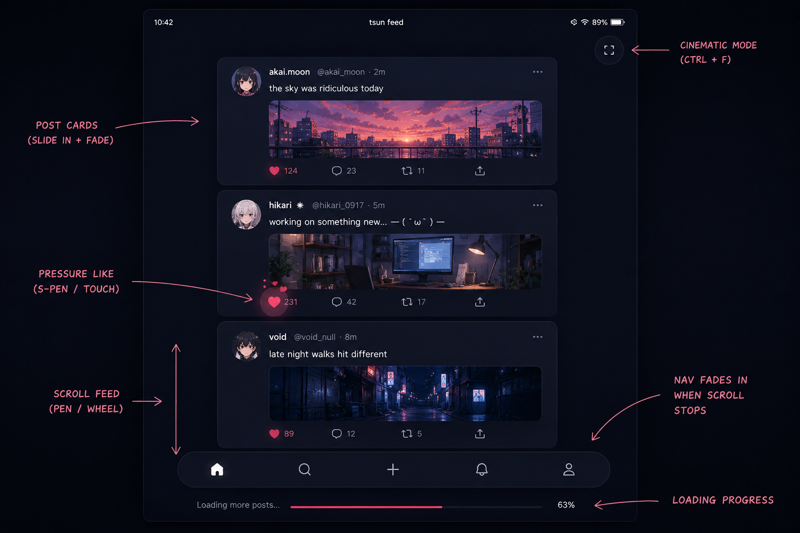

# tsundere-runtime
Me trying to do something out of my league. And recording it's journey


### Why


Hmm so as usual we were talking on discord and it was bought up how js is like bandage of web. Tbh I agree with this point. It was made in rush

have lots of obvious holes and is not really very nice to code with.

So saar suggested that if there can be a browser which doesn't need JS. And I like the dumbass that I am was like sure lemme try that, cause 

maybe then my C rotted brain would be able to design a website teheheheh. that would be nice actually. Also cause it would scratch my 

`build from scratch` itch. *`( you are supposed to laugh here )`*

And hence started the project `tsundere-runtime` i know very nice name. you can stop and praise my amazing naming skills here.

...

Now you may ask, "But, Aakarsh WASM exists, why do this." To that my response is, wasm still internally uses js as glue to manipulate DOM,

which breaks the rule of the challenge.

**So the idea is to not have JS at all. Anywhere.**

Now that presents the obvious challenge cause there is no refrence for something like this atleast i didn't find it. 

*`(Let me know if something like that exists btw)`*

I think I have clearified why part by now.


### What

Have you seen the website they make today??. It's not what was imagined 20 years ago what websites would look like. Modern websites have

shifted to SPAs, increasingly complex logic, way too many moving parts and trying to do things web was never designed to do. take modern

frameworks for example, they have state management, are event driven, have tree like structure and work being offloaded to host compute capacity more 

and more. *`(I think if someone from 90s saw today's websites they would have a crisis about how we can get here from HTML .)`* As you can see

these features sound less and less about documents doesn't it.


The website on which I am writing this blog is likely what went through the minds of people when they imagined web. Now I am in no way 

critisizing the direction the web is taking. But we are currently trying to do things using wrong tool imo.

So when I thought if current modern web is less of document and more of an application then i need to invent a stack which supports that

ideology. And the best kind of application which represents web, I would say is a **game**. from too many moving parts, 

to being very fault tolerant and ability to handle increasingly complex logic.

<!-- // Talk about game loop, the code shared with saad and somewhat about the future vision, like parent child, server it's own protocol  -->
<!-- // and stuff like that -->


### How


Lemme first define some terms so we are on same page.

1. **tsundere-runtime** : The browser/runtime/infra which I am building.
2. **baka** : The term to refer this new style of site.
3. **baka-protocol** : Transfer protocol for baka.
4. **baka-state** : The current state of baka.
5. **baka-loop** : Baka being executed.
6. **baka-server** : Server used to host your baka.

To start with what makes a game different from normal application is a **game-loop**. Your game is generally in an infinite loop,

where it communicates with other components by reading some high level record of all the things happening right now.

And the game loop was built for that only, handling complex state, managing all kinds of weird input(looking at VR) and still pushing through.

If you have used modern web frameworks you would come in contact with such concept relatively commonly.

So with that as a one of the pillars behind this project, what I am implementing in this is something very similar. I will just show the vision

for now cause I don't know how this would be done for now ;).

The flow would be something like 

1. You write your **baka**(B).
2. You start your **baka-server**(BS).
2. **tsundere-runtime**(TR) fetches it over **baka-protocol**(BP).
3. Loads the binary, and read **baka-header**(BH).
4. BH contains meta data about the baka like estimated memory required by this baka, baka magic number, baka version and so so. 
5. TR takes that under consideration and allocate memory proportional to that, smt like demand paging style (maybe).
6. TR then locates **baka_main** and executes it.

Heheh currently this is where i would continue with the steps and end the blog but I found the initial docs I had written plans about that,

It also contained a program which can be written in as baka. So I am kinda stopping with that boring steps and just showing the final

result I am expecting. *Having half-blind vision of what your projects at end looks like makes it much more exciting to build you know.*

I would first show you what a generic application from this would look like and then give you a demo for why this model is powerful in some other blog.

*`(That line written above is false. I just want to fuel my delusion more and more. It has nothing to do with demo and all to do with delusion)`*

I felt social media app would be perfect demo for this.


```C
// THE BAKA PROGRAMMING MODEL
//
// I always loved the flutter ideology of UI = f(state).
//
//   state = initial_state
//   loop:
//     interrupts -> mutate state
//     state      -> draw
//
// that's it. that's the whole model.

// Our baka_header
__attribute__((section(".baka_header")))
BakaHeader header = {
    .magic_number = 0x62616B61, // Read it after converting it to char ; ).
    .version = 1,
    .memory_mb = 64,
    .name = "tsun_feed",
};

typedef struct {
    // ALL app state lives here. one place. no context providers.
    
    f32    scroll_y;         // where we are
    f32    scroll_target;    // where we want to be
    f32    load_progress;    
    bool   loading;
    bool   cinematic_mode;
    
    // animation state - explicit.
    f32    like_scale;       // 1.0 normally, 1.4 on press, lerps back
    f32    nav_opacity;      // fades in on scroll stop
    f32    card_enter[64];   // each card slides in, 0.0 -> 1.0
    
    Post   posts[64];
    u32    post_count;
    
    // input state - raw, no synthetic events
    // I want artists to be just able to draw how app will behave and it just works. Kinda like anime, cause i want that miHoYo style bakas.
    f32    pen_pressure;
    f32    pen_x, pen_y;
    bool   pen_touching;
    
    Camera2D cam;
} FeedState;

void baka_main(const API* api) {
    FeedState* s = api->arena.alloc(sizeof(FeedState));
    
    // explicit initialization - You initialize the initial state of baka.
    *s = (FeedState){
        .scroll_y       = 0,
        .scroll_target  = 0,
        .load_progress  = 0,
        .loading        = true,
        .like_scale     = 1.0f,
        .nav_opacity    = 0.0f,
        .cam            = { .zoom = 1.0f, .smooth = 0.12f },
    };

    while (api->running()) {
        f32 dt = api->delta_time();  // frame time, ~0.016 at 60fps
        
        // -----------------------------------------
        // DEMO 1: INTERRUPTS -> STATE MUTATION
        // interrupts are the ONLY way state changes.
        // you read interrupt, you mutate state. done.
        // -----------------------------------------
        
        Interrupt intr;
        while (api->poll(&intr)) {
            switch (intr.type) {
            
            case INTR_SCROLL:
                s->scroll_target += intr.scroll.dy * 80.0f;
                s->nav_opacity    = 0.0f;  // hide nav on scroll start
                break;

            case INTR_NET:
                // new posts streamed in from server
                if (intr.net.stream == s->feed_stream) {
                    Post* p = &s->posts[s->post_count++];
                    api->net.deserialize(intr.net.data, p);
                    // spawn each post as a baka-child.
                    // posts are sandboxed - they cant touch our arena
                    p->child = api->spawn(
                        "baka://apps.tsun.social/post_card.baka",
                        .layer  = LAYER_ABOVE,
                        .data   = p,
                        .arena_mb = 4,
                    );
                }
                break;

            case INTR_TOUCH:
                // s-pen or finger
                if (intr.touch.pen) {
                    // pressure sensitive like button
                    if (intr.touch.pressure > 0.8f) {
                        api->gfx.particles_burst(
                            &s->likes_burst,
                            intr.touch.x,
                            intr.touch.y,
                            .count = (u32)(intr.touch.pressure * 32)
                        );
                        api->net.post(s->feed_stream, "like", .{
                            .post_id = hovered_post_id(s, intr.touch.x, intr.touch.y)
                        });
                    }
                }
                break;

            case INTR_KEY:
                if (intr.key.code == KEY_F && intr.key.ctrl)
                    s->cinematic_mode = !s->cinematic_mode;
                break;

            case INTR_CHILD:
                // message from a baka-child.
                // post_card.baka telling us user liked a post
                if (intr.child.msg == MSG_LIKED) {
                    s->posts[intr.child.index].likes++;
                    s->like_scale = 1.4f;
                }
                break;
            }
        }

        // -----------------------------------------
        // DEMO 2: SIMULATION
        // state evolves over time. animations, physics.
        // deterministic. same dt = same result. always.
        // record this and you can replay it perfectly.
        // -----------------------------------------
        
        // smooth scroll - exponential decay toward target
        s->scroll_y  = lerp(s->scroll_y, s->scroll_target, dt * 8.0f);
        s->cam.y     = s->scroll_y;

        // like button bounces back
        s->like_scale = lerp(s->like_scale, 1.0f, dt * 12.0f);

        // nav fades in when scroll settles
        f32 scroll_velocity = fabsf(s->scroll_target - s->scroll_y);
        if (scroll_velocity < 1.0f)
            s->nav_opacity = lerp(s->nav_opacity, 1.0f, dt * 4.0f);

        // card enter animations - each slides up as it loads
        for (u32 i = 0; i < s->post_count; i++)
            s->card_enter[i] = lerp(s->card_enter[i], 1.0f, dt * 6.0f);

        // camera zoom lerps in cinematic mode
        f32 target_zoom  = s->cinematic_mode ? 1.15f : 1.0f;
        s->cam.zoom      = lerp(s->cam.zoom, target_zoom, dt * 3.0f);

        // -----------------------------------------
        // PHASE 3: DRAW
        // state -> pixels. pure. no side effects.
        // draw functions read state, never write it.
        // if you see state mutation here its a bug.
        // -----------------------------------------

        // Our 2D rendering engine starts
        api->gfx.begin_frame();

        // spawn background wallpaper app behind us
        // it renders independently, we composite on top
        BakaChild wallpaper = api->spawn(
                "baka://apps.tsun.social/wallpaper.baka",
                .layer = LAYER_BEHIND,
                .arena_mb = 16,
                );

            // camera transform - everything below is in world space
            api->gfx.push_camera(&s->cam);

                // posts - position driven entirely by state
                for (u32 i = 0; i < s->post_count; i++) {
                    f32 enter  = s->card_enter[i];          // 0 -> 1
                    f32 offset = (1.0f - enter) * 40.0f;    // slides up 40px
                    f32 alpha  = enter;                      // fades in

                    api->child_set_transform(s->posts[i].child, .{
                        .x     = 160,
                        .y     = i * 220.0f + offset,
                        .w     = 600,
                        .h     = 200,
                        .alpha = alpha,
                    });
                }

            api->gfx.pop_camera();

            // like button - scale driven by state
            api->gfx.draw_sprite(ASSET_HEART, .{
                .x     = 880,
                .y     = 40,
                .scale = s->like_scale,  // state drives this. thats it.
                .color = 0xFFFF6B9D,
            });

            // frosted glass nav - opacity driven by state
            api->gfx.push_shader(s->blur_shader);
                api->gfx.draw_rect(0, 900, 1920, 180, 
                    color_alpha(0xFF000000, s->nav_opacity * 0.6f));
            api->gfx.pop_shader();

            api->gfx.draw_text(960, 960, "tsun.social", .{
                .font    = ASSET_FONT_INTER,
                .size    = 18,
                .color   = color_alpha(0xFFFFFFFF, s->nav_opacity),
                .align   = ALIGN_CENTER,
            });

            // loading bar - visibility driven by state boolean
            if (s->loading) {
                api->gfx.draw_rect(0, 0, 
                    (u32)(s->load_progress * 1920), 3, 
                    0xFFFF6B9D);
            }

            // pen trail - only renders when pen is touching
            if (s->pen_touching) {
                api->gfx.draw_circle(
                    s->pen_x, s->pen_y,
                    s->pen_pressure * 12.0f,  // pressure = size
                    0x88FF6B9D,
                );
            }

        api->gfx.end_frame();
    }
}
```

/// NOTE : Nothing in this model is specific to social feeds. Current naming convention is just there for demo purpose, I would name fields in api
as something like `PresentationTransitionScalar` teheheheh you would like that won't you.


/// I shared the code to chatgpt and it drew almost what i had envisioned minus some styling, for which the API is lacking currenly here lemme attach that.




So what do you think?? Would you like using something like this?? From my relatively low experience with vue, I know making something like would be

difficult for me. So this would be a win for me.

Tell me in the comments what you thought of this whole idea, where I am lacking and what more could be improved.

###### This is light for now cause it's mostly me rambling about things that have not been fully finalized it.
###### It may contain unrealistic ideas, dumb things i still think may work or challenges I have not encountered so can't see it's scope
###### Alternatively I go complete bonkers and totally go off the rails in what i implement.
